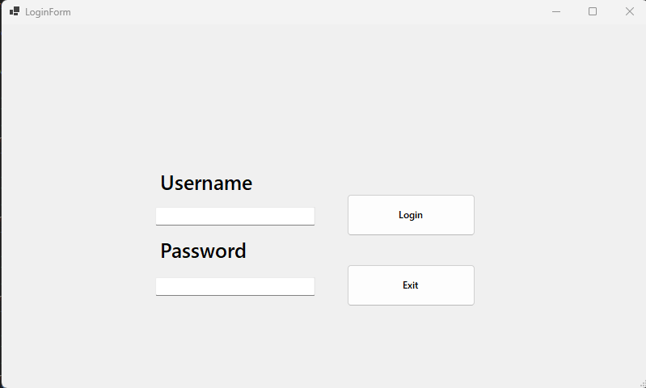
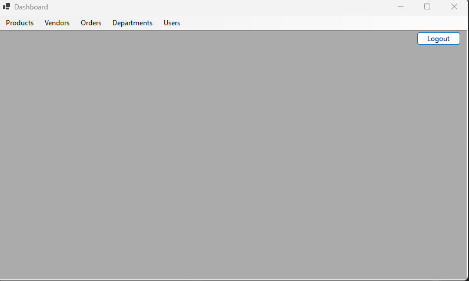
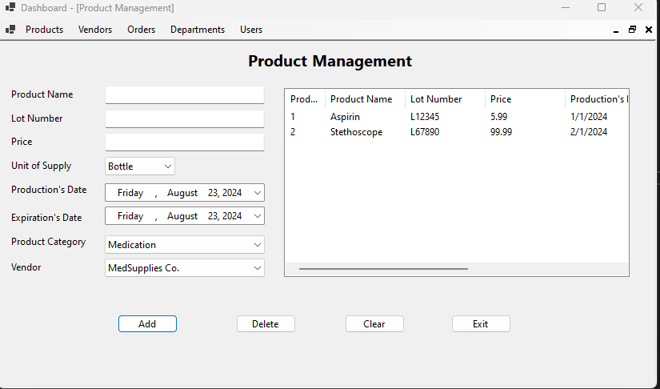
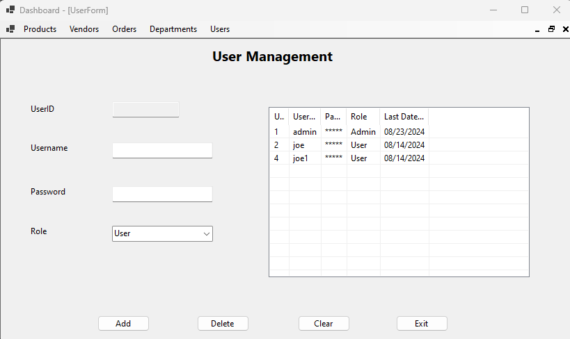

# SupplyTracker with Entity Framework

This project about supply tracker in the clinic using entity framework in order to help the clinic/hospital to track the supply in stock, get the report needed, order supply from third party as well as receive the request from different department in the clinic.

**Authors:**

[Thien Nguyen](https://github.com/bluestar7589)

[Brandon Mitzel](https://github.com/bmitzel88)

## Getting started

- Visual Studio 2022
- .Net 8
- [Supply Tracker database](SupplyTracker.sql) installed

### Step one - Run the query to generate the database in the sql server
You can generate the database by using SQL Server Object Explorer in VS 2022 or using SQL Server Management Studio.

### Step two - generate models from the database

Click on Tools -> nuget package manager -> package manager console
Type the command below to generate the models
```csharp
Scaffold-DbContext 'Data Source=(localdb)\MSSQLLocalDB;Initial Catalog=SupplyTracker' Microsoft.EntityFrameworkCore.SqlServer
```

You may need to change the DB connection string located in the SupplyTrackerContext class.
By default, it points to mssqllocaldb. You can change it to your own database.
```csharp
optionsBuilder.UseSqlServer("Data Source=(localdb)\\MSSQLLocalDB;Initial Catalog=SupplyTracker");
```

## Introduce about software

### Login screen
To login to the software in order to use the software


### Main screen


### Product screen
To input/update/delete information for the product in the stock


### User screen
To input/update/delete information for the user in the system



And so on with the other screens relate like dartment, order, request, report, etc.

Helpful website
- [Markdown cheatSheet](https://github.com/lifeparticle/Markdown-Cheatsheet)
- [MDIParent Form](https://learn.microsoft.com/en-us/dotnet/desktop/winforms/advanced/how-to-create-mdi-parent-forms?view=netframeworkdesktop-4.8)
- [Generic Interface](https://learn.microsoft.com/en-us/dotnet/csharp/programming-guide/generics/generic-interfaces)
- [TabControl](https://www.c-sharpcorner.com/article/working-with-windows-tabcontrol-with-C-Sharp/)